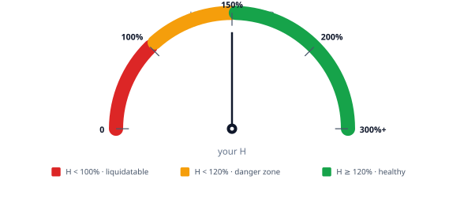

# Health factor

The health factor (H) is the single most important number you need to track when borrowing on XPower Banq. It tells you how close you are to being liquidated.

## The formula

$$
H = \frac{\sum_i w_s^i \cdot V_s^i}{\sum_i w_b^i \cdot V_b^i}
$$

where:
- $V_s^i$ is the value of your supply in token $i$
- $V_b^i$ is the value of your borrow in token $i$
- $w_s^i$ is the supply weight (`uint8`, default 170 — i.e. 170/255 ≈ 66.67% of nominal)
- $w_b^i$ is the borrow weight (`uint8`, default 255 — i.e. 255/255 = 100% of nominal)

The default weights produce an effective LTV of 170/255 ≈ **66.67%** and an implicit liquidation bonus of (255/170) − 1 = **50%**.

::: tip Plain-language version
H is just (your collateral, scaled down to 66.67% of its value) divided by (your debt), expressed as a percentage. When H = 100%, you're at the edge of liquidation. When H = 150%, you have a 50% buffer.
:::

## How to read H

| H value | Meaning |
|---|---|
| **∞** | You have supply but no borrow. Cannot be liquidated. |
| **H ≥ 200%** | Comfortable. Tolerates ~50% adverse price moves. |
| **120% ≤ H < 200%** | Healthy but worth watching during volatile periods. |
| **100% ≤ H < 120%** | Danger zone. Small adverse moves can liquidate you. |
| **H < 100%** | Liquidatable. Anyone can call `liquidate(victim, partial_exp)` (PoW-gated, public) provided *that pool* holds its own `POOL_SQUARE_ROLE` — granting/revoking the role from the pool is governance's per-pool on/off switch for permissionless liquidations. Holders of the pool's `POOL_SQUARE_ROLE` can also call `square(user, victim, partial_exp)` directly without the PoW cost. |

H is computed live whenever you interact with the protocol. You can also call `healthOf(address)` as a view (read-only) function any time, on-chain or via the app.

## What moves H

Three things change H:

1. **Prices move.** Collateral price down → H down. Debt price up → H down. (And vice versa.)
2. **Interest accrues.** Your borrow grows over time at the borrow rate; your supply grows at the supply rate. Net effect: H drifts down slowly because borrow rate > supply rate.
3. **You act.** Supplying more, repaying some debt, or transferring in collateral all raise H. Borrowing more, transferring out, or removing supply lowers H.

The first two happen automatically; the third is under your control.

What does **not** move H is a *partial* liquidation. Because a liquidation seizes the same fraction `2^-e` of your debt and your collateral, your H_after = α · C · (1−s) / (D · (1−s)) = α · C / D = H_before. A partial liquidation shrinks your position without restoring it above 100%, so it remains liquidatable until H recovers via one of the three mechanisms above. Only a *full* liquidation (`e = 0`) changes H — collateral and debt both go to zero and H = α · 0 / 0 is undefined. See [Liquidation](/concepts/liquidation).

## Targeting an H

There's no universally right H. The tradeoff is capital efficiency vs. liquidation buffer.

- **H = 100%** means you've borrowed every dollar the protocol will let you. You'll be liquidated on the first adverse tick.
- **H = 150%** is a common target for active managers — comfortable headroom, still capital-efficient.
- **H = 200%** is conservative — half your borrowing power is unused, but you'll survive almost any single move.
- **H ≥ 300%** is essentially "I want to keep this position open through anything" territory.

If you'd rather not actively manage, target H ≥ 200% and check it weekly. If you're willing to top up collateral on alerts, you can run tighter.

## Locked positions and H

Locked supply still counts toward H — locking doesn't change your collateral *value*, only your *liquidity*. The same is true for locked borrow.

What changes during liquidation is **how** the position is liquidated: locked supply transfers to the liquidator as locked tokens (the lock fraction is preserved proportionally), and the liquidator inherits the lock. This is the mechanism behind cascade attenuation. See [Cascade protection](/features/locked-positions/cascade-protection).

## Multi-token positions

If you supply multiple collateral tokens or borrow multiple debt tokens, H sums each side weighted by token. The formula generalises naturally — there's no per-pair LTV, just per-token weights.

In practice, the protocol-default weights are uniform across tokens in a pool. If governance later sets different weights for different tokens (e.g., higher weight on a riskier asset to demand more buffer), H reflects that automatically.

## Where to go next

- [Monitoring health](/using-the-protocol/monitoring-health) — practical tips for keeping H safe
- [Liquidation](/concepts/liquidation) — what happens when H drops below 100%
- [Interest rates](/concepts/interest-rates) — how the rates that affect H are set
