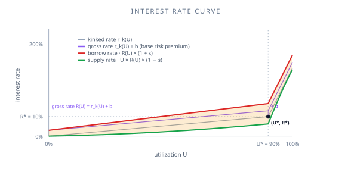

# Lending basics

Before we dive into XPower Banq's specific features, let's lay out the basic vocabulary of an over-collateralised lending protocol. If you've used Compound or Aave, you can skim this; the terminology is mostly identical.

## The two sides of the market

A lending pool has two roles:

- **Suppliers** deposit tokens into the pool. They earn interest.
- **Borrowers** take tokens out of the pool. They pay interest.

Borrowers must post **collateral** — other tokens worth more than what they're borrowing. This is what makes the system *over-collateralised*: even if a borrower disappears, the protocol can sell their collateral to repay the supply side.

## The numbers that matter

### Loan-to-Value (LTV)

LTV is the maximum borrow value divided by your collateral value. XPower Banq's default is **66.67%**, meaning 1 XPOW of collateral lets you borrow up to 0.6667 XPOW of debt. The remaining 33.33% is the **over-collateralisation buffer** — it absorbs price moves and pays the liquidation premium.

Higher LTV = more capital efficiency, but less buffer for price moves. XPower Banq's default sits in the middle of the typical range (Compound: 75%, Aave: 80%, Aave V3 E-Mode: 93%).

### Utilization

Utilization is the fraction of supplied tokens that have been borrowed:

$$
U = \frac{\text{borrowed}}{\text{supplied}}
$$

When utilization is low, rates are low (suppliers are competing for borrowers). When it's high, rates rise sharply to push it back down. The transition happens at the **kink** (default 90%). On top of the kinked curve sits an optional flat **base risk premium** (default 0%) that lifts all rates by a constant amount — see [Interest rates](/concepts/interest-rates) for the full model.

### Interest rates

Two rates govern the pool:

- The **supply rate** is what suppliers earn.
- The **borrow rate** is what borrowers pay.

The two are linked: borrow rate = R(U) × (1 + s), supply rate = U × R(U) × (1 − s), where R(U) is the utilization-dependent gross rate (kinked rate plus base risk premium), U is utilization, and s is the **spread** (default 10%). The supply rate is scaled by U because interest is only earned on the borrowed portion of the pool; the protocol keeps the difference as margin.

Below the kink, rates rise gently. Above it, they rise steeply — this is what pushes utilization back down toward the optimum.

### Health factor

Health factor measures how close your position is to being liquidatable:

$$
H = \frac{\text{weighted supply value}}{\text{weighted borrow value}}
$$

H ≥ 100% means you're solvent. H < 100% means you can be liquidated. H is implicitly the inverse of how much of your borrow capacity you've used: borrowing 50% of your max gives you H = 200%; borrowing 100% gives you H = 100%.

See [Health factor](/concepts/health-factor) for the full formula and how to read it.

## How interest accrues

Interest accrues continuously, not per-block or per-transaction. The protocol stores a global **index** that grows over time according to the rate. Your balance is your principal multiplied by the ratio of the current index to the index at the time of your last interaction.

This means:

- You don't need to claim interest. Your balance grows automatically.
- A view function on your position (`totalOf`) returns your balance including accrued interest at the current moment.
- Each new supply or borrow operation snapshots the index, so subsequent accrual is computed correctly.

Internally, XPower Banq stores the *logarithm* of the index rather than the index itself — this avoids overflow over the protocol's lifetime and improves precision. See [Log-space index](/research/papers/log-space-index) if you're curious.

## How liquidation works (briefly)

If your H drops below 100%:

1. A liquidator (keeper) calls the liquidation function with your address.
2. A slice of your debt and a slice of your collateral atomically transfer from you to the liquidator.
3. The liquidator's own health factor must remain ≥ 100% after the transfer.
4. You retain whatever wasn't liquidated. Because the slice is taken uniformly from debt and collateral, **partial liquidation preserves your health factor** — it does not restore it above 100%. Only `e = 0` (a full liquidation) closes the position; H is then undefined.

The slice size is `2⁻ᵉ`, where `e` is the **partial liquidation exponent** the caller passes — `e = 1` slices 50%, `e = 2` slices 25%, and so on. There is no protocol-stored default; the caller chooses `e` on every call. The liquidator profits from the **implicit liquidation bonus** — at the H = 100% boundary, with default weights, this is (255/170) − 1 = 50%.

See [Liquidation](/concepts/liquidation) and [Debt-assumption liquidation](/features/debt-assumption-liquidation/overview) for the full picture.

## Fees

Two small fees:

- **Entry fee** on supply: default 0.1%. Discourages flash deposits.
- **Exit fee** on redemption: default 1%. Discourages liquidity cycling.

There are no other protocol fees on transactions (gas excluded). The interest spread is the protocol's primary revenue.

## Where to go next

- [Health factor](/concepts/health-factor) — the formula and how to interpret it
- [Interest rates](/concepts/interest-rates) — the rate model in detail
- [Liquidation](/concepts/liquidation) — what happens when H < 100%
- [Positions as tokens](/concepts/positions-as-tokens) — supply and borrow as ERC20s
