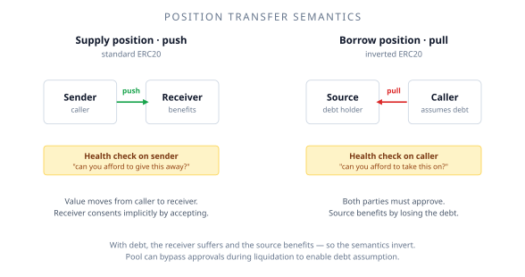

# Positions as tokens

In XPower Banq, both your supply and your debt are represented as **ERC20 tokens**. This is unusual — most protocols use position tokens only on the supply side, if at all. The choice has consequences worth understanding.

## What's an ERC20 position?

Every supply you make mints you a Supply Position token. Every borrow you take mints you a Borrow Position token. The token balance represents your *current* claim or obligation, including accrued interest — your balance grows automatically over time.

Each pool has its own pair of position tokens per supported asset. So a XPOW pool has a Supply-XPOW position token and a Borrow-XPOW position token; an APOW pool has its own pair; and so on.

## Why this matters

Three practical consequences:

### 1. You can transfer positions

You can `transfer` your supply or borrow position to another address. This effectively moves your stake (and your obligations) without exiting the protocol. Use cases include:

- Moving a position between wallets you control.
- Selling a position on a secondary market (e.g., to exit a locked position before it matures).
- Bulk-transferring positions in batched operations.

The transfer mechanics differ between supply and borrow — see below.

### 2. Positions are composable

Because positions are ERC20s, other DeFi protocols can hold them, accept them as collateral, or build on top of them. The optional **WSupplyPosition** ERC4626 wrapper (supply-side only) makes composability cleaner for protocols that expect strictly standard ERC20 / ERC4626 semantics. See [Wrapped positions](/using-the-protocol/wrapped-positions).

### 3. Your balance accrues automatically

You don't claim interest. Calling `balanceOf(you)` on a Supply Position returns your principal plus all accrued interest at the moment of the query.

This is implemented via a global **index** — a single number stored in the contract that grows over time. Your balance is computed as `principal × current_index / your_snapshot_index`. The math works out so transfers and partial settles all behave correctly without per-user updates on every interest accrual.

## The unusual part: borrow positions are inverted

Standard ERC20 transfer semantics push value from the sender to the receiver. The receiver benefits.

For debt, that's backwards — the *sender* benefits by losing an obligation, and the *receiver* takes on a liability they didn't have. So XPower Banq inverts the semantics for Borrow Positions:

| Operation | Supply position | Borrow position |
|---|---|---|
| `transfer(to, amount)` | pushes value to `to` | pulls debt **from** `from` (reversed) |
| `transferFrom(from, to, amount)` | standard | requires both parties to approve |
| Health check applies to | the sender | the receiver (who's taking on debt) |

The Pool contract, as a privileged owner, can bypass approvals to enable liquidations — this is what makes [debt-assumption liquidation](/features/debt-assumption-liquidation/overview) possible.

## Transfer with locks

If your position is partially or fully locked, transferring it moves the lock proportionally:

$$
\text{transferred lock} = \frac{\text{lock}(u_1) \cdot v}{\text{balance}(u_1)}
$$

So if you have a 100-token position with 60 tokens locked (60% lock ratio) and transfer 50 tokens, the recipient receives 50 tokens with 30 of them locked. Your remaining 50 tokens still have 30 locked (60% ratio preserved).

This proportional transfer is what makes locked-position secondary markets work: a buyer of locked supply is buying a *partially-locked* position with the lock fraction intact.

## Practical notes

- **Standard ERC20 calls work.** `balanceOf`, `totalSupply`, `transfer`, `approve`, `allowance` all behave as expected (with the inverted direction for borrow). Most wallets and indexers will display positions correctly.
- **Position tokens have decimals.** They match the underlying asset's decimals (with a minimum of 6 enforced).
- **Position tokens have names and symbols.** The `name()` is `"<token.name()> Supply"` or `"<token.name()> Borrow"` — i.e. the underlying ERC20's full `name()` plus the suffix. The `symbol()` encodes side and pair as `s<TOKEN>:<BUDDY>` for supply and `b<TOKEN>:<BUDDY>` for borrow. Two special cases apply (see `Position::_symbol`): the **APOW/XPOW** native pair drops the buddy suffix (`sAPOW`/`sXPOW`/`bAPOW`/`bXPOW`), and **WAVAX** is rewritten to `AVAX` on either side. So the APOW supply position in the APOW/XPOW pool has symbol `sAPOW` (not `sAPOW:XPOW`), and the XPOW borrow position has symbol `bXPOW`. In other pairs (e.g. APOW/USDC), the colon form applies: `sAPOW:USDC`, `bUSDC:APOW`.

## Where to go next

- [Transferring positions](/using-the-protocol/transferring-positions) — the practical mechanics
- [Wrapped positions](/using-the-protocol/wrapped-positions) — when to use WPosition
- [ERC20 semantics](/for-developers/erc20-semantics) — the developer-facing detail
- [Debt-assumption liquidation](/features/debt-assumption-liquidation/overview) — what the inversion enables
