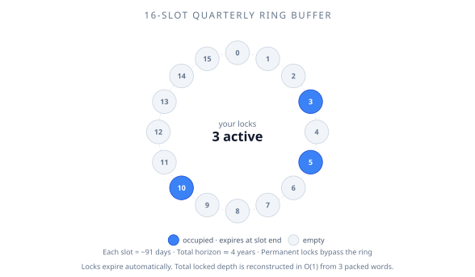

# Timed vs permanent locks

XPower Banq supports two flavours of position lock. They look similar from the outside but behave differently in important ways.

## Timed locks

A timed lock pins your principal for a specified duration, then expires automatically. The protocol stores up to 16 active timed locks per user, each in a quarterly **slot**. Each slot represents one calendar quarter (~91 days).

- **Minimum term:** any positive seconds offset; in practice locks land in the next slot at minimum (~3 months remaining of the current quarter).
- **Maximum term:** 15 slot-offsets from `now`, ≈ 45 months. The ring buffer's total horizon spans 16 slots ≈ 48 months, but the slot already holding the next-expiring lock can't be re-targeted — only the *next 15* slots are addressable from `now`.
- **Granularity:** quarterly. A lock created at any time during a quarter expires at the end of that quarter (after the chosen number of slots).
- **Expiry:** automatic. No action required from you. Once a slot's epoch has passed, the locked tokens become liquid again.

You can have multiple timed locks at once — different amounts with different expiry dates. The 16-slot ring buffer means you can structure a "ladder" of locks expiring at staggered intervals.

::: tip Slot semantics
The ring buffer reuses slots after ~4 years. If you create a new lock that maps to a slot containing an already-expired lock, the protocol cleans up the old one automatically (a "self-healing" operation). You don't need to manually clear expired locks, but doing so via the Position's `free(user)` operation reclaims gas in subsequent operations.
:::

## Permanent locks

A permanent lock has no expiry. The principal is locked **forever**. You created it; you can never redeem it.

- **Term:** infinite.
- **Storage:** the protocol uses a single packed field for permanent locks rather than ring slots, so adding to a permanent lock is cheaper than adding to a timed lock.
- **Cascade attenuation:** the (1 − ϕ) attenuation in the cascade theorem applies *only* to the permanent-locked fraction. Timed locks contribute attenuation only until their expiry.

## When to use which

| Situation | Recommendation |
|---|---|
| You have a known holding period (e.g., locked employer tokens, a tax planning horizon) | Timed lock matched to your horizon |
| You want maximum bonus and don't care about flexibility | Permanent lock |
| You're a long-term APOW holder using XPower Banq as yield infrastructure | Probably a permanent lock or a multi-year timed lock |
| You're using XPower Banq tactically (leverage, arb) | Don't lock — keep your liquidity |
| You want some lock for the bonus, some for flexibility | Lock part of your position; leave the rest liquid |

## Bonus differences

The interest bonus/malus scales with your **lock ratio** — the fraction of your balance that's locked, weighted by remaining time. Permanent locks count at their full value forever; timed locks contribute proportionally to their remaining duration.

This means a permanent lock of 1 token earns more bonus than a 1-quarter timed lock of 1 token, integrated over time. See [Bonus and malus](/features/locked-positions/bonus-and-malus) for the formula.

## Cascade-protection asymmetry

The Cascade Attenuation Theorem (in the protocol whitepaper) bounds cascade severity by (1 − ϕ), where ϕ is the **permanent-locked** fraction.

Timed locks attenuate cascades only while active. A timed lock that expires the day before a crash provides zero protection. Permanent locks always count.

If your goal is cascade protection — e.g., you're a major supplier who wants the pool to survive — a permanent lock is the only way to commit credibly.

## Practical advice

- Most users supplying for yield should pick a timed lock with a multi-quarter horizon. The bonus is meaningful and the commitment is bounded.
- Borrowers should be conservative with locks. Locking your debt prevents early repayment, which can hurt if your circumstances change.
- Permanent locks are an ideological choice as much as a financial one. Don't make it lightly.

## Where to go next

- [Bonus and malus](/features/locked-positions/bonus-and-malus) — the rate adjustments
- [Transfers and exits](/features/locked-positions/transfers-and-exits) — how to get out of a lock
- [Locking positions](/using-the-protocol/locking-positions) — the practical UI/call walkthrough
