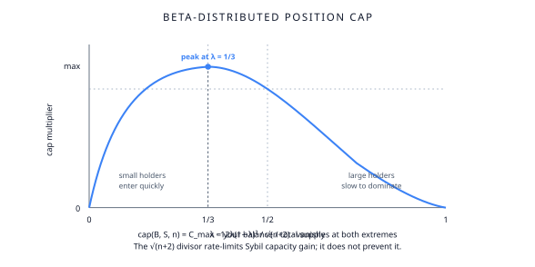

# Position caps

The protocol rate-limits how fast any single account can grow its position. The mechanism uses a **beta-distributed cap function** combined with a **√(n+2) divisor** that requires repeated capital injections to accumulate share.

This is **rate-limiting**, not Sybil-prevention. A patient and well-capitalised attacker can still accumulate a significant share — but they have to do it slowly, across many independent operations, over many blocks.

## The cap function

For a user with current balance `B`, a pool with total supply `S`, and the protocol-wide large-holder count `n` (see below), the cap is:

$$
\text{cap}(B, S, n) = C_{\max} \cdot \frac{12 \lambda (1-\lambda)^2}{\sqrt{n+2}}
$$

where `λ = B/S` is the user's current share of the pool, and `n = largeHolders()` is the **global count** of addresses currently holding at least one whole token unit in the position (`Position::_capOf`). `n` is not a per-user counter — it's a single protocol-wide value, floored at the governance parameter `MIN_HOLDERS_ID` (`Position::largeHolders()` returns the max of the live count and this parameter). The parameter is unset at construction (default `0`); `Constant.MIN_HOLDERS` (1e18) is the governance *ceiling* for it, not a default.

The cap function vanishes at both extremes (λ = 0 and λ = 1), peaks at λ = 1/3, and shrinks with the square root of `n`. `n` increases when a new address crosses *from below* one unit to *at-or-above* one unit (`Position::_update`), and decreases when an existing holder's balance drops back below.

## What this means in practice

- **Small holders enter quickly.** At λ ≈ 0, the cap function rises rapidly. New users can deposit a meaningful amount on their first operation.
- **Large holders slow down.** As λ approaches 1/3 and beyond, the cap function falls. A user near 1/3 of the pool can only add a small amount per operation.
- **The divisor tightens as the pool gets more holders.** Every additional address that crosses the unit threshold pushes `n` up, shrinking every existing user's cap by a `√(n+1+2) / √(n+2)` factor.

## Why beta-distributed?

The beta-shape `12λ(1-λ)²` was chosen because it:

- Peaks at λ = 1/3, naturally limiting any single user to roughly that fraction of the pool.
- Vanishes smoothly at λ = 0 (so the very first deposit isn't artificially large).
- Vanishes at λ = 1 (so a single user cannot dominate the pool entirely).
- Has zero derivative at λ = 1, giving a soft approach to the upper bound.

The constant 12 is chosen to make the peak height `12 × (1/3) × (4/9) = 16/9 ≈ 1.78`, normalising the cap function so that `C_max` is the meaningful absolute bound.

## Why √(n+2)?

The √(n+2) divisor implements **Sybil rate-limiting**. Without it, an attacker could split capital across N accounts and each one would see the same generous cap. With it, splitting across N fresh addresses pushes `n` up by ~N and shrinks every cap by `√(n+N+2) / √(n+2)` — meaningful but bounded gain that scales as `O(√N)` per address.

The "+2" inside the square root provides headroom even at the `MIN_HOLDERS_ID` floor, avoiding pathological behaviour near the lower bound of the holder count.

## What it does and doesn't prevent

- **Prevents:** sudden monopolisation. A flash-loan-funded actor cannot deposit 90% of the pool in one block — the cap function cuts them off.
- **Prevents:** small-scale spam. Each repeated operation faces increasing friction.
- **Doesn't prevent:** patient accumulation. An attacker willing to spread operations across many blocks (and many addresses) can still accumulate a large share over time.
- **Doesn't prevent:** colluding actors with separate Sybil-resistant identities. The protocol can't tell two distinct addresses apart from two coordinated ones.

The whitepaper's quantitative analysis: a patient, well-capitalised attacker retains ~48.6% of share after 60 weeks. The mechanism slows but does not stop sufficiently determined attackers.

## Subsections

- **[How caps grow](/features/position-caps/how-caps-grow)** — the dynamics of cap evolution over time
- **[New user allocation](/features/position-caps/new-user-allocation)** — what a fresh user can do on their first operation
- **[Caps wrapper and circuit breaker](/features/position-caps/caps-wrapper-and-circuit-breaker)** — the delta-based `Caps` wrapper and the `banq-cl` cap-limit monitor
