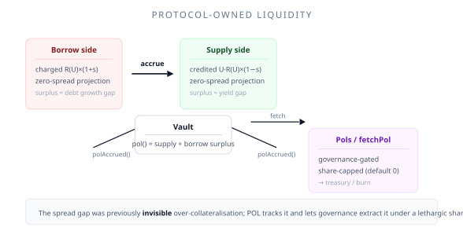

# Protocol-Owned Liquidity (POL)

**Protocol-owned liquidity** (POL) is the spread surplus that a vault accumulates over time: borrowers pay `R(U) × (1 + s)`, suppliers earn `U × R(U) × (1 − s)` (utilization-scaled), and the residual `2s` spread on the **borrowed** portion compounds inside the vault as invisible over-collateralisation. POL makes that surplus *visible* and — under a governance-gated share cap — *extractable*.

The code and role identifiers that touch this feature use the `Pols` / `POLS` spelling (the wrapper contract is named `Pols`); the concept itself is referred to as POL throughout these docs.



## Where the surplus comes from

The interest spread `s` (default 10%) is the protocol's margin. Every accrual window produces a small surplus on each side:

- **Supply side.** Suppliers are credited interest at the utilization-scaled rate `U × R(U) × (1 − s)`, so their position grows more slowly than the full gross rate (and only on the borrowed portion of their principal).
- **Borrow side.** Borrowers are charged interest at the increased rate `R(U) × (1 + s)`, so their debt grows faster than the gross rate.

The difference between "what was actually credited/charged" and "what the zero-spread projection would have produced" is the POL increment for that position and that window. Summed over all users and all time, it is the vault's accumulated surplus. The supply-side projection uses the same utilization scaling as the actual supply rate, so POL always measures a genuinely funded surplus — never a claim on idle-capital interest.

## How it is tracked

POL is tracked **position-level**, not vault-level. Each Supply and Borrow Position accumulates its own `polAccrued()` figure, computed from a *zero-spread projection*: for every accrual window the position re-computes what its balance would have grown to if the spread had been zero, and the gap against the actual (spread-applied) value is the increment.

- Supply: `polAccrued() += max(total₀ − total, 0)`
- Borrow: `polAccrued() += max(total − total₀, 0)`

The zero-spread projection re-baselines the stale portion of the window at the base spread, which makes the increment **exact for any user** while `SPREAD` is constant. The only residual error is a small, transient, uniform term during a `SPREAD` governance transition.

The vault then sums both sides:

```
pol() = supply.polAccrued() + borrow.polAccrued()
```

`pol()` is monotonic — it never decreases, and it is never reset.

## The extraction cap

Extraction is gated by a single vault parameter, `POL_FETCHABLE_SHARE` (default **0%**):

```
maxTotal     = pol() × polFetchableShare / WAD
maxFetchable = maxTotal − polFetched()
fetched      = min(amount, maxFetchable)
```

- `polFetchableShare = 0` — nothing is extractable; the surplus stays protocol-resident.
- `polFetchableShare = 100%` — governance may fetch the full accumulated surplus.

The cap is **cumulative, not per-call**: it applies to the total surplus minus whatever has already been fetched, so repeated calls can never extract more than the share ceiling. The default is `0`, so a vault is born "locked" — extraction only becomes possible after governance raises the share via [lethargic governance](/features/lethargic-governance/overview).

## What it means for users

Nothing, operationally. POL tracking runs in parallel with interest accrual and does not change any user-facing behaviour:

- Your rates and balances are unaffected.
- Interest accrual is fully decoupled from POL accounting.
- POL values are in underlying-asset units — no conversion needed.

Extraction only moves surplus *out of a vault* into a governance-chosen recipient, subject to the share cap. Depositors still own the full underlying backing; the extracted surplus is the portion the protocol had already priced in as margin.

## Extraction (briefly)

Governance (or an operator with the right role) calls `fetchPol(target, amount)` on the Vault, or the `Pols` wrapper contract, which forwards to it. The recipient can be any address, or the zero address — which advances the fetched baseline without transferring anything (a "sentinel burn", used for bookkeeping). See [Fetching and roles](/features/protocol-owned-liquidity/fetching-and-roles).

## Why it matters

1. **Visibility.** The spread gap was previously accounting deadweight — a growing but unmeasurable over-collateralisation. POL turns it into an on-chain number.
2. **Treasury optionality.** The protocol can eventually sweep surplus to a treasury or buy back tokens, without changing user rates or the interest model.
3. **Predictability.** The lethargic share cap tells the market exactly what fraction of the surplus is extractable vs. protocol-resident, and that fraction can only change slowly.

## Where to go next

- [Fetching and roles](/features/protocol-owned-liquidity/fetching-and-roles) — the `Pols` wrapper and role model
- [Vault parameters](/parameters/vault-parameters) — `POL_FETCHABLE_SHARE` and fees
- [ERC4626 vaults](/for-developers/erc4626-vaults) — the vault contract that hosts POL
- [Events and indexing](/for-developers/events-and-indexing) — the `FetchPol` event
