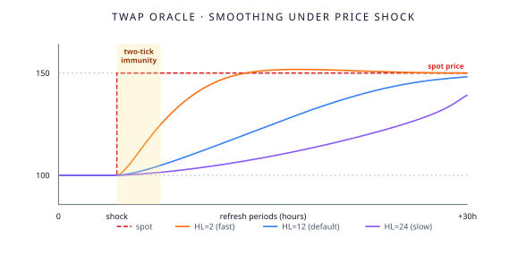

# TWAP oracle

XPower Banq prices assets using a **time-weighted average price** (TWAP) computed in **log-space** — i.e., the protocol smooths the *logarithm* of the price rather than the price itself. This is geometric smoothing, and it's the right shape for prices, which are naturally multiplicative.

The oracle is deliberately slow. Sudden price moves take time to propagate. That's a feature, not a bug — slow oracles are robust against single-block manipulation.

## The model

The protocol stores a smoothed log-price `L` and updates it on each oracle refresh:

$$
L_{t+1} = \alpha \cdot L_t + (1 - \alpha) \cdot \log(p_{t+1})
$$

where:
- `α` is the **decay factor**, default 0.944 — chosen for a 12-hour half-life on a 1-hour refresh interval.
- `p_{t+1}` is the new spot price observation.

The exponentiated log-price `e^L` is the protocol's reported price, used for health-factor and liquidation calculations.

## Why log-space?

Two reasons:

1. **Geometric mean.** Smoothing in log-space gives a geometric mean over time, which is the natural average for compounding processes (and prices are compounding processes — a 50% drop and a 100% rise don't cancel arithmetically).
2. **Bidirectional spread.** The protocol stores both a smoothed log-price and a smoothed log-spread. Combining them gives bid/ask quotes consistent with empirical market microstructure (where bid-ask spreads scale with log-price).

For details, see [Log-space index](/research/papers/log-space-index).

## Refresh interval

The oracle refreshes at most once per `LIMIT` (default 1 hour). Any source quotes between refreshes are ignored — the protocol uses the cached value.

This is a security choice. A flash loan can move a spot price within a single block, but cannot affect the oracle's stored value until the next refresh — and even then, the new sample is heavily smoothed (only `(1 − α) ≈ 5.6%` weight).

## Two-tick immunity

A consequence: the protocol has **two-tick flash-loan immunity**. To move the reported price meaningfully, an attacker would need to control the spot price across at least two oracle refreshes — i.e., maintain a manipulated price for the full LIMIT period.

For a 1-hour LIMIT, that's an hour of holding manipulated price. This is economically infeasible against a deep market.

## How long does manipulation take?

The whitepaper computes: to shift the reported TWAP price by 90% of the way from the original to the manipulated value:

- HL = 2 hours: ~6.6 hours of sustained manipulation.
- HL = 12 hours (default): ~40 hours.
- HL = 24 hours: ~80 hours.

These are economically impossible for a determined attacker against any liquid market.

## Subsections

- **[Manipulation resistance](/features/twap-oracle/manipulation-resistance)** — what attacks the oracle resists
- **[Spread and slippage](/features/twap-oracle/spread-and-slippage)** — how the bidirectional spread works
