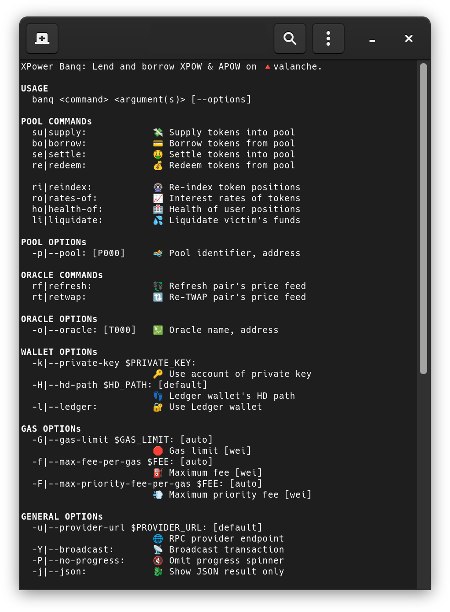

# CLI and tools

`banq-cli` is the official command-line interface for XPower Banq. It's a single
Deno-built binary that covers the full surface of the protocol: keeper
operations (liquidate, oracle refresh, ACMA inspection), user operations
(supply, borrow, settle, redeem), and the auxiliary XPOW mining / APOW claiming
flows. Most pages elsewhere in this section assume you have it installed.

This page is filed under "For keepers" because keepers are the heaviest CLI
users — the GUI is sufficient for ordinary supply/borrow flows, but
liquidations, oracle refreshes, and role inspection are CLI-first.



## Install

`banq-cli` is built with [Deno](https://deno.com/) v2.0+. Build from source or
grab a prebuilt binary from the
[GitHub releases](https://github.com/blackhan-software/xpower-banq-cli/releases).

```sh
# from source
deno run install
deno run build-banq

# install
sudo cp ./dist/banq-mainnet.x86_64-linux.run /usr/local/bin/banq
sudo chmod +x /usr/local/bin/banq

banq --help
```

Pre-built artifacts ship for `x86_64` Linux/macOS/Windows plus `aarch64`
Linux/macOS.

## Configuration

| Variable       | Purpose                                                                                  |
| -------------- | ---------------------------------------------------------------------------------------- |
| `PROVIDER_URL` | Avalanche C-Chain RPC. Default: `https://api.avax.network/ext/bc/C/rpc`.                 |
| `PRIVATE_KEY`  | Signing key for write operations. Optional — Ledger hardware wallets are also supported. |
| `CONTRACT_RUN` | Protocol-deployment selector. Default `v10c`; set to `v10c` for the current mainnet.     |

Environment variables are loaded from (in increasing precedence):
`etc/banq/banq.env.mainnet`, `.env.mainnet`, `.env.mainnet.local` (and analogous
files for `testnet`).

::: warning Never pass keys as CLI arguments A `PRIVATE_KEY` on the command line
is visible to anyone with `ps aux`. Always export it (with a leading space, to
skip shell history): `export PRIVATE_KEY=0x...`. Better still, use Ledger. :::

## Dry-run by default

Every write command is a dry-run unless you pass `-Y` / `--broadcast`. The CLI
will still build, simulate, and report the result of the call — it just won't
sign and send. This makes the tool safe to explore: you can copy commands from
this page and run them against mainnet without risking funds.

```sh
banq supply 1.0 APOW --pool=P000              # dry-run
banq supply 1.0 APOW --pool=P000 -Y           # actually sends
```

## Keeper commands

These are the highest-leverage commands for a running keeper.

### `liquidate` — debt-assumption liquidation

```sh
banq liquidate $VICTIM [--pool=P000] [-Y]
```

Liquidates the underwater account `$VICTIM` in the chosen pool. The CLI calls
the public, PoW-gated entry point `Pool.liquidate(victim, partial_exp)`; the
contract enforces difficulty against the caller's recent XPOW activity via the
`powlimited` modifier (no per-call mining is performed by the CLI). The
role-restricted direct path `Pool.square(user, victim, partial_exp)` — gated by
the pool's `POOL_SQUARE_ROLE` (a per-pool role) — is reserved for keepers
operating under explicit ACMA grant and is not currently exposed as a separate
CLI subcommand. See
[Debt-assumption liquidation](/features/debt-assumption-liquidation/overview).

### `health-of` — query a position's health factor

```sh
banq health-of $USER [--pool=P000]
```

Read-only. Useful as the basic monitoring primitive — the response includes
weighted supply value, weighted borrow value, and the resulting `H`.

### `retwap` — recompute the TWAP

```sh
banq retwap XPOW APOW [--oracle=T000] [-Y]
```

Refreshes the log-space TWAP for the given pair. `Oracle.retwap(source, target)`
is `restricted` — the role check is `FEED_RETWAP_ROLE`.

### `refresh` — refresh a price feed

```sh
banq refresh XPOW APOW [--oracle=T000] [-Y]
```

Drops a fresh sample into the underlying source feed. The on-chain
`Oracle.refresh(source, target)` is PoW-gated
(`powlimited(refreshDifficulty())`) and rate-limited via a `delayed(...)`
modifier — i.e. permissionless but throttled.

### `rates-of` — interest-rate snapshot

```sh
banq rates-of XPOW [--pool=P000]              # current
banq rates-of XPOW [--pool=P000] --at=all     # full history
```

Reports current supply / borrow rates plus the parameters that produced them.
With `--at=all`, replays the rate history (useful for plotting; pair with
`etc/plot-rates.py`).

### `acma` — ACMA inspection

```sh
banq acma                          # show authorisation matrix
banq acma roles                    # all roles with metadata
banq acma members [-a]             # role members + execution delays
banq acma targets                  # selector → role mapping
banq acma hierarchy                # admin/guard tree
banq acma delays [-a]              # grant + admin delays
banq acma logs [-n 50] [-e ...]    # chronological event log
```

The single most useful command when reasoning about a "who can do what when"
question — particularly during incident response.

## User-side commands

```sh
banq supply  1.0 APOW [--pool=P000] [-Y]
banq borrow  1.0 XPOW [--pool=P000] [-Y]
banq settle  1.0 XPOW [--pool=P000] [-Y]
banq redeem  1.0 APOW [--pool=P000] [-Y]
banq reindex     APOW --mode=supply  [--pool=P000] [-Y]
banq reindex     XPOW --mode=borrow  [--pool=P000] [-Y]
```

`reindex` advances the per-position log-space index — useful before reading
balances if precise accrued interest matters more than gas.

## Mining and claiming

The XPOW mining pipeline is composable via stdin/JSON, so the standard pattern
is to mine on a hot box and submit from a cold one:

```sh
banq xpow-init [-Y]                                   # once per hour
banq xpow-mine [-Y] -Pj --pow-level=8 | nc 127.0.0.1 8765
nc -l 8765 | banq xpow-mint [-Y] -Pj \
  --max-priority-fee-per-gas=0 \
  --max-fee-per-gas=500000000 \
  --gas-limit=100000

banq apow-claim       APOW --nft-id=202500            [-Y]
banq apow-claim-batch APOW --nft-id=202500,202503     [-Y]
```

## Where to go next

- [Running a liquidator](/for-keepers/running-a-liquidator) — production-keeper
  checklist
- [Monitoring and tooling](/for-keepers/monitoring-and-tooling) — what to watch
- [Contract addresses](/for-developers/contract-addresses) — `--pool=PNNN` and
  `--oracle=TNNN` selectors
