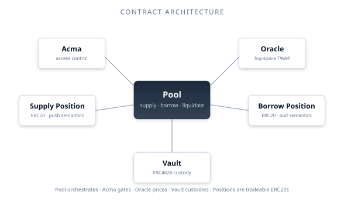
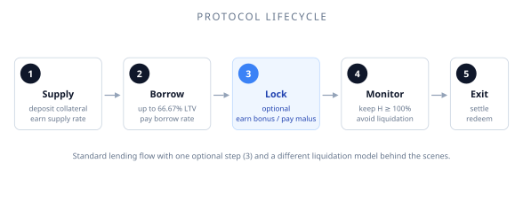
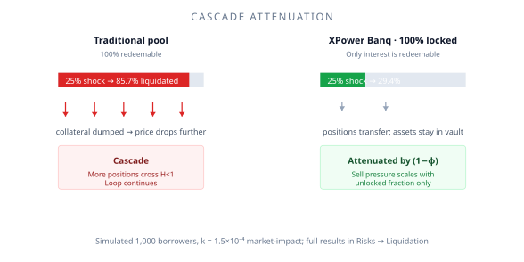
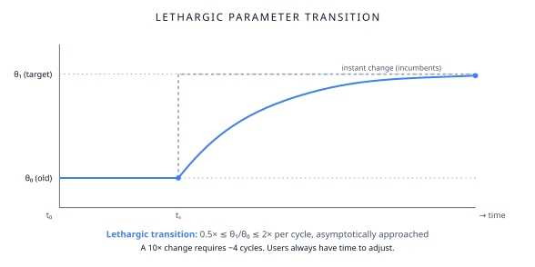
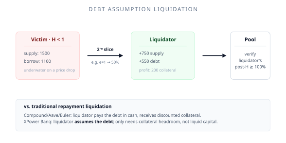

# How it works

A five-minute tour of the protocol from the user's point of view. We'll defer the math and the contract details to later sections.

## The protocol as a building

Think of XPower Banq as a small, automated bank.

There are six contracts inside the building:

- The **Vault** is the actual safe. Tokens you deposit live here.
- The **Pool** is the front desk. Every operation — supply, borrow, repay, withdraw, liquidate — goes through it.
- **Supply Position** and **Borrow Position** are receipts. They're plain ERC20 tokens that represent what you've supplied or owe.
- The **Oracle** quotes prices, smoothed over time so a one-block spike can't move them.
- **Acma** is the door. It controls who's allowed to do what.
- **WSupplyPosition** (optional) wraps Supply positions as an ERC4626 vault for protocols that expect standard ERC4626 semantics. Borrow positions are not wrappable.

That's the whole system. Everything else is variations on these pieces.

## The basic lifecycle

1. **Supply.** You deposit a supported token. You get back a Supply Position ERC20. Your token is now earning interest.
2. **Borrow.** You can borrow a different token against your supply, up to the loan-to-value limit. You get a Borrow Position ERC20 representing your debt. You pay interest on it.
3. **Lock (optional).** You can lock either position for a chosen term — any whole number of quarters from 1 (~3 months) up to 15 (~45 months), or permanently. Locked supply can't be withdrawn; locked borrow can't be repaid early. In exchange, locked suppliers earn extra interest and locked borrowers pay reduced interest.
4. **Monitor.** Your **health factor** measures how solvent your position is. It must stay above 100%. If the price of your collateral falls or your debt grows, your health factor drops. If it goes below 100%, you can be liquidated.
5. **Exit.** Repay your borrow (called **settle**) and withdraw your supply (called **redeem**). You receive your principal plus accrued interest, minus any fees.

## The three things people ask about

### Why locks?

Lending cascades happen because liquidations dump collateral, and dumped collateral pushes prices lower. If the locked portion of a position can't be sold even after liquidation, that sell pressure simply doesn't exist.

In simulation, the difference is large: under a 25% price shock, locked-only pools see 29.4% of positions liquidated, versus 85.7% in unlocked pools.

The catch: this only works if enough people lock. The protocol incentivises locking with bonus interest, but the equilibrium is path-dependent. See [Cascade protection](/features/locked-positions/cascade-protection) for the full story.

### Why "lethargic" governance?

Most protocols can change parameters instantly. That's a security weakness — a compromised governor can drain a protocol in a single block.

XPower Banq governance is deliberately slow: every change is bounded to a 2× factor, and the new value phases in asymptotically rather than jumping.

This means:

- A 2× change takes one cycle (a month).
- A 10× change takes 4 cycles.
- A 64× change takes 6 cycles.

You always have time to react.

### Why does liquidation work this way?

Most protocols require the liquidator to *repay the victim's debt* with their own liquid capital, in exchange for discounted collateral. That's restrictive — liquidation gets dominated by a few well-capitalised firms.

XPower Banq liquidation is **debt assumption**: the liquidator takes on a slice (typically half) of the victim's debt *and* the corresponding collateral, atomically. They need their own collateral to absorb the new debt — but no liquid stablecoins.

The economics are equivalent to a traditional liquidation, but the capital requirements are very different. A user with 1.5 APOW of collateral can liquidate a position worth 1 APOW; in a traditional protocol, they'd need 1 APOW of stablecoins instead.

## The pieces you don't have to think about

These run automatically and you can mostly ignore them:

- **Interest rates** rise as utilization rises, with a sharp slope above the kink at 90% utilization. This pushes utilization back down toward the optimal level.
- **The oracle** updates at most once per hour, smoothing prices over a 12-hour half-life. Sudden price moves take time to propagate.
- **Position caps** rate-limit how fast any one address can grow. New users get a baseline allocation; the cap shrinks as you approach a 1/3 share of the pool.
- **Governance** parameter changes always pass through the lethargic transition.

## Where to go next

- **Concepts in detail:** [Lending basics](/concepts/lending-basics) and [Health factor](/concepts/health-factor)
- **Each feature in depth:** start with [Locked positions](/features/locked-positions/overview)
- **Use it now:** [Quickstart](/introduction/quickstart)
