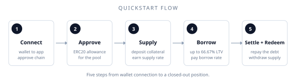

# Quickstart

This is a hands-on walkthrough of supplying and borrowing on XPower Banq for the first time. We'll skip the optional features (locks, transfers, wrapping) until later sections.

::: tip
This guide is interface-agnostic. The exact UI may vary; what matters is the underlying calls.
:::

## Prerequisites

- A wallet (e.g., MetaMask, Rabby) connected to a supported chain.
- Some APOW (or AVAX, depending on chain) for gas.
- A supported token to supply. The list of supported tokens is per-pool; check [Contract addresses](/for-developers/contract-addresses) or the app.

## 1. Connect your wallet <i class="bi bi-plug"></i>

Open the XPower Banq app at [app.xpowerbanq.com](https://app.xpowerbanq.com), click **Connect**, and approve in your wallet. The app will detect the chain and show you the available pools.

## 2. Approve the token <i class="bi bi-check-circle"></i>

Before the protocol can pull tokens from your wallet, you need to give it ERC20 approval. The app will prompt you for this on your first supply or repay.

You can approve only the amount you intend to deposit, or grant unlimited approval — the latter is cheaper in gas across multiple deposits but carries the usual standing-approval risk.

## 3. Supply a token <i class="bi bi-box-arrow-in-down"></i>

Choose a pool and a token. Enter an amount. The app shows you:

- Your **expected supply rate** at current utilization.
- Your **resulting health factor** (if you also have a borrow position).
- Any **entry fee** (default: 0.1%).

Click **Supply** and confirm in your wallet. After the transaction confirms:

- The vault now holds your tokens.
- You hold a **Supply Position** ERC20, which earns the supply rate continuously.

::: info Locking
You can supply with a lock by passing a non-zero `dt_term`. We'll cover this in [Locking positions](/using-the-protocol/locking-positions).
:::

## 4. Borrow against your supply <i class="bi bi-cash-stack"></i>

In the same pool, select a different token to borrow. The app shows you:

- Your **borrowing power**, which is your supply value times the LTV (default 66.67%).
- The **borrow rate** at current utilization.
- Your **resulting health factor**.

Click **Borrow** and confirm. After the transaction:

- You receive the borrowed tokens in your wallet.
- You hold a **Borrow Position** ERC20 representing your debt.
- Your health factor is now finite (it was infinite before).

::: warning Keep your health factor above 100%
If your H drops below 100%, your position can be liquidated. Most users target H ≥ 150% to absorb normal price moves. See [Monitoring health](/using-the-protocol/monitoring-health).
:::

## 5. Repay (settle) and withdraw (redeem) <i class="bi bi-arrow-repeat"></i>

When you're done:

1. **Settle.** Repay your borrow position. The protocol pulls the owed amount (principal + accrued interest) from your wallet.
2. **Redeem.** Withdraw your supply. The protocol returns your principal plus accrued interest, minus the exit fee (default 1%).

For locked positions, only accrued interest can be redeemed before the lock expires; the principal stays put.

## A worked example

Say you want to leverage some APOW exposure:

1. You supply **1 APOW** worth 3,000 XPOW.
2. The default LTV is 66.67%, so you can borrow up to **2,000 XPOW**.
3. You borrow **1,500 XPOW**, leaving headroom (your H ≈ 3,000 XPOW / 1,500 XPOW / 1.5 = 1.33 — still healthy but tight).
4. You spend the XPOW, or convert it to more APOW, or whatever your strategy is.
5. Later, you settle by repaying the XPOW plus interest, and redeem your APOW.

::: warning What happens if APOW crashes
If APOW crashes meanwhile, your H drops. If it falls below 100%, a liquidator can take a slice of your position via [debt assumption](/features/debt-assumption-liquidation/overview). The penalty is the implicit liquidation bonus — up to ~50% at the H = 100% boundary with default weights — and you lose more collateral than the debt repaid. The slice size is chosen by the liquidator (no protocol-stored default), and partial liquidation preserves your H, so the position can be sliced again immediately if you stay underwater.
:::

## Common mistakes <i class="bi bi-x-circle"></i>

- **Borrowing right up to the limit.** A 5% adverse move can liquidate you. Leave headroom.
- **Forgetting that locked principal can't be redeemed early.** Lock with the term you actually intend to commit to.
- **Treating supply position tokens as the underlying.** They're ERC20s representing a *claim* on the underlying. Trading them on a secondary market exits your position; transferring them moves your position (and its lock state) proportionally to the recipient.

## Where to go next

- **Concepts in depth:** [Lending basics](/concepts/lending-basics)
- **The features that distinguish XPower Banq:** [Locked positions](/features/locked-positions/overview)
- **Detailed task pages:** [Supplying assets](/using-the-protocol/supplying-assets), [Borrowing assets](/using-the-protocol/borrowing-assets)
